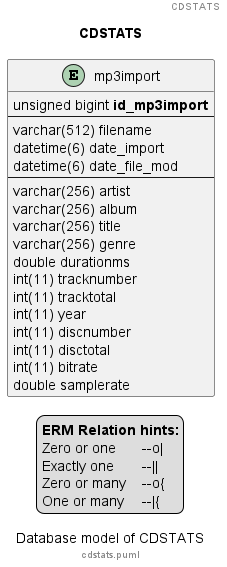

# cdstats

Various statistics based on ID3 tags of MP3 files.

## Motivation

I'm ripping all my CDs to MP3 files. With a number of > 800 CDs I've got a large number of MP3 files. After listening to a song I knew from another artist I thought about some statistics.

## Details

The program is splitted up into two parts. The `data collector` will collect the information from the MP3 files and will store the data into a database.

The second part will run several plugins. Each plugin will determine a statistic. The planned statistics are:

- For all songs
  - Number of songs
  - Song with shortest playtime
  - Song with longest playtime
  - Songs with same name but different artists
- For an artist
  - Number of songs
  - Song with shortest playtime
  - Song with longest playtime

### Data collector

The data collector will work the following steps:

- Check if given path is existing, abort if not
- Find all MP3 files
- For each MP3 file
  - Read ID3 tag
  - Insert/Update ID3 meta data in database

For details see [readme][app_datacollector] of `datacollector` project.

### CDStats

The CD Stats program will establish a connection to the database. Additional an output stream for a HTML file is created. Then it will load all plugins and pass the db connection as well as the output stream to each plugin. Forces by an `interface` each plugin will run a simple db task, the results are written to the passed output stream.

For details see [readme][app_cdstats] of `cdstats` project.

### Plugin mechanism

Mind collection to plugin system:

- Requires access to the database
- Output will be a HTML file
- Each plugin outputs
  - Headline for statistic
  - Data of statistic
  - Appends data to passed HTML file

## Tasks

- ~~Create ERM for project using [PlantUML][tool_puml]~~ Done 03.08.2024
- ~~Initial project~~ Done 04.08.2024
- ~~Create [data collector][app_datacollector] - see README.md there~~ Done 09.12.2024
- Create plugin system
  - Load plugins
  - Run each plugin
- Create statistical plugins
  - Common overview
    - Number of total tracks
    - Number of genres
    - Number of artists
    - Total playing time
    - Longest track
    - Shortest track

### ERM diagram

The source of the diagram is [here][file_erm]. To get fast results for the plugins a flat table is used. This needs improvement for later state.

## Technology

- This program is written in [C#][code_c#]
- Inspired from my other project [Weatherstation][project_weatherstation]
  - The configuration file handling
  - The plugin system
- Reading the ID3 tags is based on [TagLibSharp][lib_taglibsharp]

[app_cdstats]: ./cdstats/README.md
[app_datacollector]: ./datacollector/README.md
[code_c#]: https://learn.microsoft.com/en-us/dotnet/csharp/tour-of-csharp/
[file_erm]: ./cdstats.puml
[lib_taglibsharp]: https://github.com/mono/taglib-sharp
[project_weatherstation]: https://github.com/ThirtySomething/Weatherstation
[tool_puml]: https://plantuml.com/
