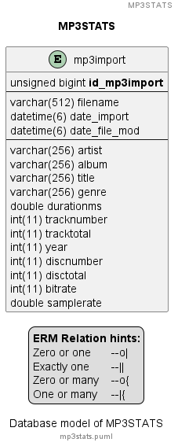

# MP3STATS

Various statistics based on ID3 tags of MP3 files.

## Licence

This project uses the [MIT licence][licence_mit]. The licences of the used packages are listed at the bottom.

## Motivation

I'm ripping all my CDs to MP3 files. With a number of > 800 CDs I've got a large number of MP3 files. After listening to a song I knew from another artist I thought about some statistics.

## Details

The program is splitted up into two parts. The `DataCollector` will collect the information from the MP3 files and will store the data into a database.

The second part `MP3Stats` will run several plugins. Each plugin will determine a statistic.

### DataCollector

The `DataCollector` will work the following steps:

- Check if given path is existing, abort if not
- Find all MP3 files
- For each MP3 file
  - Read ID3 tag
  - Insert/Update ID3 meta data in database

For details see [readme][app_datacollector] of `DataCollector` project.

Currently there is no logic for check move of MP3 files inside the collection. But to detect this a filehash (MD5) is generated during import and written to the DB. This may slow down the process. This is configurable, the default is `do not calculate the hash`. For details see [DataCollectorConfig.UseHash][code_datacollectorconfig].

### MP3STATS

The `MP3Stats` program will establish a connection to the database. Additional an output stream for a HTML file is created. Then it will load all plugins and pass the db connection as well as the output stream to each plugin. Forces by an `interface` each plugin will run a simple db task, the results are written to the passed output stream.

For details see [readme][app_mp3stats] of `mp3stats` project.

### Plugin mechanism

The plugin mechanism is based on my other project, `weatherstation` [here][project_weatherstation].

### ERM diagram



The source of the diagram is [here][file_erm]. To get fast results for the plugins a flat table is used. This will also simplify the queries in the plugins.

The diagram is made with [PlantUML][tool_puml].

## Technology

- This program is written in [C#][code_c#]
- Inspired from my other project [Weatherstation][project_weatherstation]
  - The configuration file handling
  - The plugin system
- Reading the ID3 tags is based on [TagLibSharp][lib_taglib#]

## Usage

After compilation somewhere at the `bin` path you can find two executables.

- `datacollector.exe` - The part to get the data into the database.
- `mp3stats.exe` - The part to generate the statistics.

### Configs

There are a bunch of config files where the program can be adjusted to the needs.

#### DBConfig.config

This config file defines the name of the SQLite database.

```xml
<?xml version="1.0" encoding="utf-8"?>
<DBConfig xmlns:xsi="http://www.w3.org/2001/XMLSchema-instance" xmlns:xsd="http://www.w3.org/2001/XMLSchema">
  <DBFilename>mp3stats.db</DBFilename>
</DBConfig>
```

#### DataCollectorConfig.config

This config is used to influence the `DataCollector`. The settings are

- `MP3Path` => Root path of the MP3 collection
- `MP3Pattern` => Obviously the file extension of the MP3 files
- `DataTranslation` => This is a workarround to fix the behaviour of [TagLib#][lib_taglibsharp]. There the single artist `AC/DC` will become to two artists `AC` and `DC`. The translation data is case sensitive!
- `UseHash` => If this is set to `true`, a MD5 hash is created of the MP3 file when it is added to the internal list. This setting has heavy influence on the speed.

```xml
<?xml version="1.0" encoding="utf-8"?>
<DataCollectorConfig xmlns:xsi="http://www.w3.org/2001/XMLSchema-instance" xmlns:xsd="http://www.w3.org/2001/XMLSchema">
  <MP3Path>m:\</MP3Path>
  <MP3Pattern>*.mp3</MP3Pattern>
  <DataTranslation>{'ac;dc':'ac/dc'}</DataTranslation>
  <UseHash>false</UseHash>
</DataCollectorConfig>
```

#### MP3StatsConfig.config

This config is used to influence the `MP3Stats`. The settings are

- `StatisticsMainFile` => The name of the main statistics file - `index.html` is so annoying
- `PathPlugin` => In case the plugins reside in a subdirectory
- `PathOutput` => Outpout path of the statistics

```xml
<?xml version="1.0" encoding="utf-8"?>
<MP3StatsConfig xmlns:xsi="http://www.w3.org/2001/XMLSchema-instance" xmlns:xsd="http://www.w3.org/2001/XMLSchema">
  <StatisticsMainFile>MP3Stats.html</StatisticsMainFile>
  <PathPlugin />
  <PathOutput>./mp3stats/</PathOutput>
</MP3StatsConfig>
```

## Sample output

An example of a statistic can be viewed [here][app_statistic].

## Libraries

All used libraries are sticked to `mp3stats_core` to have no redundancy of various versions of the NuGet packages.

- [Microsoft.EntityFrameworkCore][lib_efc] - [MIT licence][licence_mit]
- [NLog][lib_nlog] - [BSD3 clause licence][licence_bsd3]
- [Newtonsoft.Json][lib_newton_json] - [MIT licence][licence_mit]
- [Pomelo.EntityFrameworkCore.MySql][lib_pomelo] - [MIT licence][licence_mit]
- [z440.atl.core][lib_taglibsharp], also known as [TagLib#][lib_taglibsharp] - [MIT licence][licence_mit]

[app_datacollector]: ./datacollector/README.md
[app_mp3stats]: ./mp3stats/README.md
[app_statistic]: ./sample/MP3Stats.html
[code_c#]: https://learn.microsoft.com/en-us/dotnet/csharp/tour-of-csharp/
[code_datacollectorconfig]: ./datacollector/DataCollectorConfig.cs
[file_erm]: ./mp3stats.puml
[lib_efc]: https://www.nuget.org/packages/Microsoft.EntityFrameworkCore/
[lib_newton_json]: https://www.nuget.org/packages/Newtonsoft.Json/
[lib_nlog]: https://www.nuget.org/packages/NLog/
[lib_pomelo]: https://www.nuget.org/packages/Pomelo.EntityFrameworkCore.MySql/
[lib_taglibsharp]: https://github.com/mono/taglib-sharp
[lib_taglibsharp]: https://www.nuget.org/packages/z440.atl.core/
[licence_bsd3]: https://licenses.nuget.org/BSD-3-Clause
[licence_mit]: https://licenses.nuget.org/MIT
[project_weatherstation]: https://github.com/ThirtySomething/Weatherstation
[tool_puml]: https://plantuml.com/
